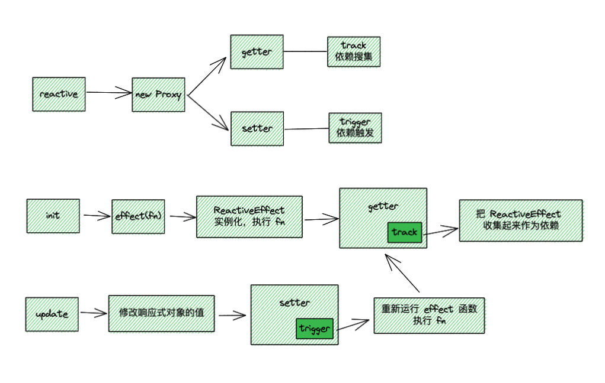

# reactivity 笔记

## 流程

## reactive 

响应式的入口，本质是通过 Proxy 返回一个新的响应式对象，该对象在 getter 和 setter 里分别做依赖收集（track）和依赖触发（trigger）

## effect

接受一个 function 函数，调用时会实例化一个 ReactiveEffect，并立即触发该函数，如果该函数里触发 getter，那么会把该实例收集起来

update(返回值): ReactiveEffect 初始化时立即触发会把当前 funciton 函数返回，称为 runner，后续可以再 ReactiveEffect 外部主动触发；同时也可以把 function 的值返回

update(scheduler): effect 可以有第二个参数 options 对象，传入 scheduler 函数可以在触发依赖的时候执行 scheduler 而不是执行 runner

update(stop/onStop): stop 可以在外部把 runner 函数停止，即在依赖触发的时不运行 function 函数。逻辑是 track 的时候 ReactiveEffect 也把 deps 收集起来、runner 挂载 ReactiveEffect 实例。在调用 stop 的时候通过 runner -> ReactiveEffect -> deps -> 遍历 delete effect（还增加一个 active 锁防止 stop 多次调用）；
effect 第二个参数 options 对象可以传入 onStop 函数，可以在外部执行 stop 的时候执行

## track

在 getter 的时候，分别通过 target 和 key 作唯一的 Map 映射，把当前 ReactiveEffect 实例收集到 dep 里

## trigger

在 setter 的时候，通过 target 和 key 的唯一映射拿到依赖收集的 dep，触发每一个 ReactiveEffect 实例的 run 方法

update(scheduler): 当 ReactiveEffect 实例有 scheduler 函数时，scheduler 函数代替 run 函数执行