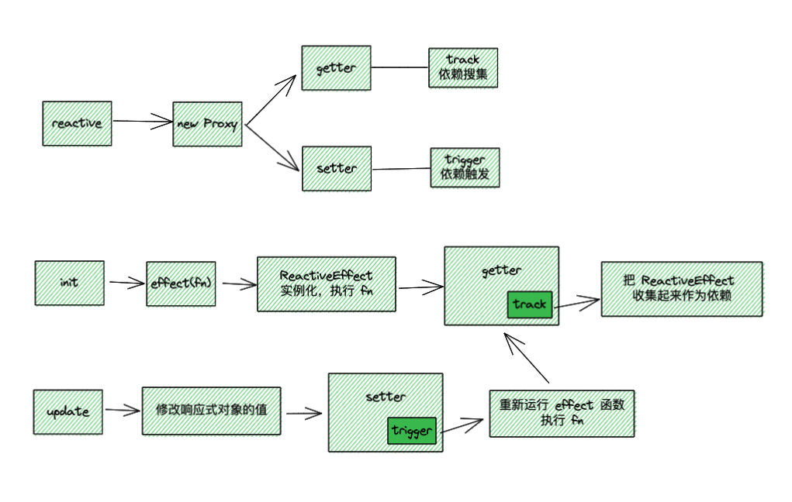

# reactivity 笔记

## 流程

## reactive 

响应式的入口，本质是通过 Proxy 返回一个新的响应式对象，该对象在 getter 和 setter 里分别做依赖收集（track）和依赖触发（trigger）

## effect

接受一个 function 函数，调用时会实例化一个 ReactiveEffect，并立即触发该函数，如果该函数里触发 getter，那么会把该实例收集起来

## track

在 getter 的时候，分别通过 target 和 key 作唯一的 Map 映射，把当前 ReactiveEffect 实例收集到 dep 里

## trigger

在 setter 的时候，通过 target 和 key 的唯一映射拿到依赖收集的 dep，触发每一个 ReactiveEffect 实例的 run 方法