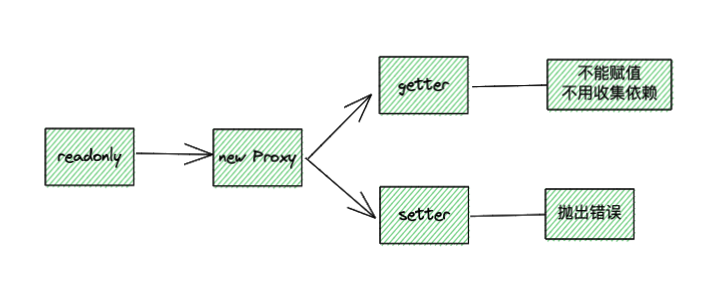

# readonly

## 流程

如命名 readonly 一样言简意赅，readonly 创建一个不能修改内部属性的响应式对象。

介绍一下 TDD 的流程：
1. 先写测试用例
2. 实现测试用例的功能
3. 确保测试用例通过的情况下重构

实现 readonly 功能的同时，把 reactive 和 readonly 的代码复用重构到 baseHandler 文件里。
优化点：get 和 set 函数在初始化时创建，后续再调用 reactive/readonly 都是同一个对象，不用重新创建（readonlyGet 同理）。